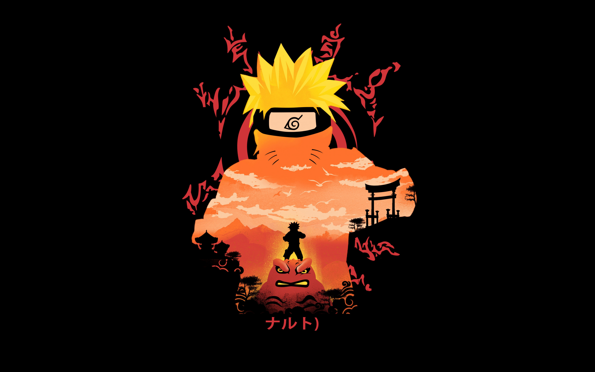

# 🎮 Guess the Naruto Characters  

  

## 🌟 About the Game  
**Guess the Naruto Characters** is a fun and interactive web game where players test their knowledge of Naruto by identifying characters based on their images. If you're a Naruto fan, this game is perfect for you!  

## 🚀 Features  
✔️ **Exciting Gameplay** – Guess Naruto characters based on their images.  
✔️ **Instant Feedback** – Get real-time results on your guesses.  
✔️ **Score Tracking** – Keep track of your correct answers.  
✔️ **Responsive Design** – Works smoothly on all screen sizes.  
✔️ **Simple & Fun UI** – Easy to use, even for first-time players.  

## 🛠️ Technologies Used  
- **HTML5** – Structure and content of the game.  
- **CSS3 (or SCSS/Less)** – Beautiful styling and animations.  
- **JavaScript (ES6+)** – Handles game logic and interactivity.  
- **FontAwesome** – Adds stylish icons.  

## 🔧 How to Install & Play  
1. **Clone the Repository**:  
   ```bash
   git clone https://github.com/mkatfi/game_Guess_the_Naruto_characters
   ```  
2. **Navigate to the Project Folder**:  
   ```bash
   cd game_Guess_the_Naruto_characters
   ```  
3. **Launch the Game**:  
   - Open `index.html` in your favorite browser.  
   - Start guessing Naruto characters! 🎉  

## 🎮 How to Play  
1. Look at the displayed **Naruto character image**.  
2. Type the character’s **name** in the input field.  
3. Click **Submit** to check your answer.  
4. If correct, move on to the **next character**. If incorrect, try again!  
5. Keep playing and see how many you can guess correctly!  

## 🏆 Screenshots  
✨ *Give users a preview of the game by adding screenshots here!*  
Example:  
  

## 🤝 Contributing  
Want to improve this game? Awesome! Feel free to:  
- **Report bugs** 🐞  
- **Suggest new features** 💡  
- **Improve the UI/UX** 🎨  
- **Optimize the code** 🚀  

## 🎤 Acknowledgements  
- **All Naruto fans** who enjoy the game!  

---

💡 *Enjoy the game & test your Naruto knowledge!* 🚀🔥  

```

---

### 🔥 **Why This is Better:**  
✅ **More Engaging & Exciting** – Uses emojis and better formatting.  
✅ **More Informative** – Includes sections like Features, Screenshots, and Contributions.  
✅ **Professional Look** – Well-structured with clear headings and descriptions.  
✅ **Encourages Contributions** – Invites people to contribute.  

This will make your GitHub repo look more **polished and attractive**! 🚀 Let me know if you need further improvements! 😊
